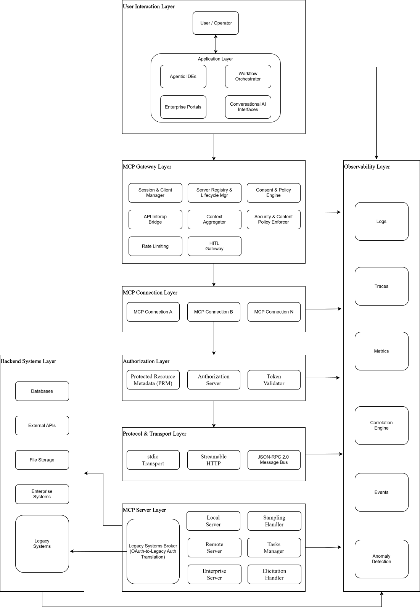

# Executive Summary

This reference architecture defines a modular, governed, and extensible **Model Context Protocol (MCP)** system designed for enterprise environments. It provides a structured approach for implementing MCP hosts, clients, and servers while enforcing a zero-trust security model that ensures safety, compliance, observability, and explicit human consent.

MCP is an open protocol that standardizes how AI applications connect to external data sources, tools, and services. It uses JSON-RPC 2.0 for message exchange and supports both local (stdio) and remote (Streamable HTTP) transports. The protocol defines three core server primitives: **Tools** (executable actions), **Resources** (read-only contextual data), and **Prompts** (reusable templates). These exist alongside cross-cutting capabilities for asynchronous tasks, server-initiated LLM sampling, and structured user elicitation.

The architecture is organized into distinct layers:

- **User Interaction Layer**: The entry point for end users and applications.
- **MCP Gateway Layer**: The governing boundary that manages the MCP host role, server registry, routing, policy enforcement, consent, and context aggregation. This is the enterprise control plane for all MCP activity.
- **MCP Connection Layer**: Isolated protocol connection instances, each maintaining a dedicated 1:1 session with a single MCP server.
- **Authorization Layer**: OAuth 2.1 flows with PKCE, Protected Resource Metadata discovery, and token audience binding.
- **Protocol & Transport Layer**: stdio for local servers and Streamable HTTP for remote services, both framed by JSON-RPC 2.0.
- **MCP Server Layer**: Context and capability providers exposing tools, resources, prompts, and cross-cutting capabilities.
- **Backend Systems Layer**: The authoritative data stores, external APIs, file systems, and enterprise platforms that MCP servers interact with.
- **Observability Layer**: Collects logs, traces, metrics, events, and anomalies from every layer for monitoring, audit, and threat detection.

Together, these layers form a cohesive system that enables safe, reliable, and auditable agentic workflows. The architecture emphasizes governance, modularity, and interoperability, ensuring organizations can scale MCP capabilities while maintaining control and trust.

# Table of Contents

- [Executive Summary](#executive-summary)
- [MCP Reference Architecture](#mcp-reference-architecture)
- [User Interaction Layer](#user-interaction-layer)
- [MCP Gateway Layer](#mcp-gateway-layer)
- [MCP Connection Layer](#mcp-connection-layer)
- [Authorization Layer](#authorization-layer)
- [Protocol & Transport Layer](#protocol--transport-layer)
- [MCP Server Layer](#mcp-server-layer)
- [Backend Systems Layer](#backend-systems-layer)
- [Observability Layer](#observability-layer)
- [Security Threat Model](#security-threat-model)
- [Architecture Decision Log](#architecture-decision-log)

# MCP Reference Architecture

# User Interaction Layer

The User Interaction Layer serves as the entry point of the MCP system. It captures human intent, delegates requests to the application, and surfaces outputs, consent prompts, and approval requests back to the user.

- ## User / Operator
    Represents the individual or system initiating a request. The user may be an employee, developer, analyst, or automated process depending on the deployment context. The user expresses goals, provides inputs, responds to consent requests, and reviews outputs produced by the agentic system. In supervised deployments, the operator may additionally configure policies, approve server registrations, and audit session histories.

- ## Application
    Serves as the presentation and orchestration surface for user interactions. The application is any MCP-aware software that the user interacts with directly, including agentic IDEs, workflow orchestrators, conversational AI interfaces, custom enterprise portals, and any other software that initiates MCP sessions. The application receives user inputs, forwards them to the MCP Gateway Layer, and returns responses. It also implements human-in-the-loop controls, including structured approval flows for tool calls, sampling requests, and data access operations, ensuring that the user retains meaningful control over agentic behavior at all times.

# MCP Gateway Layer

The MCP Gateway Layer is the governing architectural boundary, operational control plane, and stateful session-aware data plane for all MCP activity. It corresponds to the **Host** role in the MCP specification, the entity that instantiates clients, mediates server access, and maintains user-facing controls, but is explicitly architected as a purpose-built gateway to meet enterprise scale, security, and interoperability requirements.

In production deployments, the MCP Gateway functions as a stateful, session-aware data plane that understands JSON-RPC message bodies, manages long-lived MCP sessions, and enforces enterprise-grade policies across all agent-tool interactions. It is not a traditional stateless reverse proxy; it is a control plane designed specifically for agentic systems, capable of tracking session context, multiplexing requests across backend servers, and dynamically adjusting exposed capabilities on a per-client basis.

- ## Session & Client Manager
    Responsible for the complete lifecycle of all MCP client instances and their underlying transport sessions. It creates client connections, monitors health, enforces per-client permission scopes, and tears down sessions when no longer required.

    - **Session Multiplexing & Demultiplexing:** A single client request (for example, "list all available tools") may fan out across multiple backend MCP servers, collect responses, and assemble a unified answer. This is a fundamental capability that distinguishes an MCP gateway from a generic reverse proxy.
    - **Per-Client Tool Virtualization:** Different users, tenants, or agents may have access to different tool sets based on identity and policy. The manager dynamically adjusts the tools and capabilities exposed to each client session, preventing information leakage about restricted backend capabilities.
    - **MCP Version Negotiation:** Supports protocol version negotiation to decouple client upgrades from backend server upgrades. Clients and servers negotiate capabilities during the `initialize` handshake, and the gateway ensures compatible protocol versions are used across the session boundary.
    - **Client Isolation:** Enforces the critical architectural invariant that each client maintains an exclusive, opaque connection to a single server, with cross-server interactions exclusively mediated through the gateway.

- ## Server Registry & Lifecycle Manager
    Maintains the centralized catalog of all MCP servers available to the deployment. It governs server discovery, registration, health monitoring, and onboarding approval.

    - **Registration & Approval Workflows:** Before any server is exposed to clients, it must pass through structured onboarding. The registry captures server metadata, capability declarations, provenance information, and integrity hashes. Servers are allowlisted only after security review.
    - **Dynamic Discovery & Health Monitoring:** Continuously monitors registered server health and capability availability. Unhealthy or misbehaving servers can be automatically deprioritized or removed from the client-facing catalog.
    - **Capability Indexing:** Server capabilities (tools, resources, prompts, task support) are indexed to enable rapid fan-out queries and to support the Context Aggregator in building multi-server workflows.
    - **Backend Routing Patterns:** Supports static backends (direct server addresses), dynamic backends (label selectors for service discovery), and virtual backends (multiplexing multiple servers behind a single endpoint).

- ## Consent & Policy Engine
    Enforces the principle of **explicit user consent** mandated by the MCP specification. Before any tool is invoked, any resource is accessed, or any data is transmitted to a server, the engine validates that the user has been informed and has provided affirmative consent.

    - **Connect-Time Authentication (Eager Auth):** For interactive deployments, authentication happens once at connection time rather than on every tool call. The gateway runs the enterprise SSO flow when a user connects, stores tokens, and subsequent tool calls proceed without repeated authentication interruptions. This prevents the user experience degradation that occurs when each remote server handles its own OAuth independently.
    - **Deferred Consent via Elicitation:** For autonomous agents and background pipelines where a human is not immediately present, consent requests are queued, routed to appropriate reviewers, and execution is gated until approval is received.
    - **Fine-Grained Tool-Level Policies:** Enforces access control beyond raw OAuth scopes. For example, granting read access but not delete access on the same resource.

- ## Context Aggregator
    Synthesizes context from multiple active client sessions to support multi-server agentic workflows. It manages context window budgets, applies summarization and trimming strategies, and mediates server-initiated sampling requests by ensuring servers receive only the contextual information they need.

    - **Multi-Tenancy Context Isolation:** Enforces strict boundaries between tenant contexts, preventing data leakage across organizational or team boundaries.
    - **Context Budget Management:** Applies token and message budget limits across aggregated sessions to prevent runaway context growth.

- ## Security & Content Policy Enforcer
    Applies organizational guardrails to all inbound and outbound data flows. It implements zero-trust validation of all tool descriptions, server-provided metadata, and user prompts, treating all server-supplied content as untrusted until validated.

    - **Prompt Guards & Content Safety:** Detects and blocks prompt injection attacks, PII exfiltration, and unsafe content in both request and response paths.
    - **Tool Poisoning Protection:** Protects against tool shadowing (replacing a legitimate tool with a malicious one), rug pulls (removing a tool after initial registration), and direct tampering. Validates tool descriptions against allowlisted schemas and detects unexpected behavioral changes.
    - **Dynamic Policy Evaluation:** Policies take effect immediately when updated, without requiring clients to re-establish MCP sessions.

- ## API Interoperability Bridge
    Enables seamless integration between MCP and existing enterprise API ecosystems. It provides protocol translation, API virtualization, and schema adaptation so that organizations can leverage their existing API investments without rewriting every backend as a native MCP server.

    - **OpenAPI-to-MCP Translation:** Existing REST APIs described by OpenAPI specifications can be dynamically exposed as MCP tools through the gateway. This includes direct exposure of individual operations and AI model-controlled orchestration for complex multi-step API workflows.
    - **Composable MCP Pipelines:** Defines custom MCP tools as multi-step pipelines that chain HTTP calls and MCP tool calls together, with each step referencing outputs from previous steps. This removes the need to build custom MCP servers for common aggregation patterns.
    - **Protocol Adaptation:** Translates between MCP primitives and enterprise protocols (REST, GraphQL, gRPC), handling authentication mapping, parameter validation, and response sanitization.

- ## Human-in-the-Loop Gateway
    Provides mechanisms for human reviewers to inspect, approve, modify, or reject agent actions before they are executed. It is the integration point for **elicitation requests** from MCP servers, routing structured user input prompts to the appropriate review interface.

    - **Synchronous Approval Flows:** Execution is gated on immediate user confirmation. Default mode for interactive desktop agents.
    - **Asynchronous & Deferred Escalation:** For autonomous agents and high-risk operations, actions trigger supervisor review pipelines or queue consent requests via MCP elicitation, with full audit trails.

# MCP Connection Layer

The MCP Connection Layer contains a pool of isolated, stateful protocol connection instances, each maintaining a dedicated session with a single MCP server. This 1:1 connection-to-server relationship is a fundamental architectural invariant of MCP, designed to ensure that servers cannot access data from other servers and that the MCP Gateway retains full control over all cross-server information flows.

- ## MCP Connection (per Server)
    Each MCP connection instance is responsible for:

    - **Stateful Session Management:** Establishing and maintaining a single long-lived session with its assigned server, including connection lifecycle, reconnection handling, and graceful termination.
    - **Protocol Negotiation:** Executing the `initialize` handshake to negotiate protocol version and exchange capability declarations. Only mutually declared capabilities are activated.
    - **Capability Exchange:** Declaring client-side capabilities (Sampling, Roots, Elicitation) and receiving server capabilities (Tools, Resources, Prompts, Task support) in return.
    - **Bidirectional Message Routing:** Dispatching JSON-RPC requests to the server and routing server notifications, requests, and responses back to the appropriate gateway component.
    - **Subscription Management:** Managing server-side resource subscriptions and processing change notifications.
    - **Security Boundary Maintenance:** Ensuring tokens, session state, and context from one client instance are never accessible to any other client instance.

# Authorization Layer

The Authorization Layer implements the OAuth 2.1-based authorization framework for HTTP-based MCP transports. It provides the cryptographic identity, token lifecycle management, and audience binding mechanisms that ensure all remote MCP server interactions are authenticated, authorized, and scoped to the minimum necessary permissions.

Local stdio-based servers use environment-based credentials and do not participate in this flow.

- ## Protected Resource Metadata (RFC 9728)
    MCP servers are classified as OAuth Resource Servers. Each remote MCP server must publish a well-known metadata document that identifies the authorization server clients should use to obtain access tokens. Clients discover this metadata via the `WWW-Authenticate` header in 401 responses or by probing well-known URIs. The metadata includes `authorization_servers`, supported `scopes`, and the canonical `resource` URI.

- ## Authorization Server
    Issues access tokens following the OAuth 2.1 authorization flow. Key requirements:

    - **PKCE with S256:** All clients must implement Proof Key for Code Exchange using the `S256` challenge method.
    - **Discovery:** Authorization servers must support RFC 8414 Authorization Server Metadata or OpenID Connect Discovery 1.0.
    - **Dynamic Client Registration (RFC 7591):** Supported as a fallback for clients lacking a pre-existing relationship with the authorization server.
    - **Client ID Metadata Documents:** The preferred registration mechanism for scenarios where clients and servers have no prior relationship. Clients host a metadata document at an HTTPS URL, which the authorization server fetches and validates.
    - **Short-lived Tokens:** Access tokens should have short lifetimes; refresh tokens should be rotated for public clients.

- ## Token Validator
    Enforces audience binding for every access token presented to an MCP server. A server must validate that the token was specifically issued for it as the intended audience, rejecting tokens issued for other resources. **Token passthrough to upstream APIs is explicitly prohibited** to prevent confused deputy attacks.

    Resource Indicators (RFC 8707) are mandatory: clients must include the `resource` parameter in authorization and token requests, identifying the target MCP server's canonical URI.

# Protocol & Transport Layer

The Protocol & Transport Layer defines the communication channels over which MCP messages flow between clients and servers. All MCP messages are encoded as JSON-RPC 2.0 and must be UTF-8 encoded. The layer provides bidirectional communication, capability negotiation during session initialization, and utilities for progress tracking, message cancellation, and structured error reporting.

- ## stdio Transport
    The recommended transport for local MCP servers. The application launches the MCP server as a managed subprocess; JSON-RPC messages are exchanged via standard input and output streams, delimited by newlines. This transport is inherently local with no network exposure, making it the lowest-risk deployment model. Authorization is handled via environment variables rather than OAuth flows. Servers must not write non-MCP content to stdout.

- ## Streamable HTTP Transport
    The standard for remote and enterprise MCP servers. Uses HTTP POST for client-to-server messages and supports optional Server-Sent Events (SSE) for server-to-client streaming. A single MCP endpoint supports both POST and GET methods.

    **Critical security requirements:**
    - Servers must validate the `Origin` header on all connections to prevent DNS rebinding attacks, rejecting invalid or absent Origins with HTTP 403.
    - Locally deployed servers must bind to `127.0.0.1` rather than `0.0.0.0`.
    - All endpoints must be served over TLS 1.3. Post-quantum key exchange using hybrid key encapsulation mechanisms such as ML-KEM in combination with classical ECDHE is required to mitigate harvest now, decrypt later threats.
    - OAuth 2.1 Bearer token authentication is required for protected endpoints.
    - Session management must use TTL-bounded session IDs.
    - The transport supports stream resumability via event IDs and `retry` hints.

- ## JSON-RPC 2.0 Message Bus
    All MCP messages are framed as JSON-RPC 2.0 requests, responses, and notifications. Cross-cutting utilities include:

    - **Capability Negotiation:** The `initialize` / `initialized` lifecycle establishes the shared capability set for each session.
    - **Progress Tracking:** Long-running operations support progress notifications.
    - **Cancellation:** In-flight requests can be cancelled via `CancelledNotification`.
    - **Structured Error Reporting:** Errors include machine-readable codes and human-readable descriptions.

# MCP Server Layer

The MCP Server Layer is the ecosystem of context and capability providers that MCP clients connect to. Each server exposes a focused set of capabilities through three first-class primitives and a set of cross-cutting mechanisms. Servers operate independently with well-defined responsibilities, enabling composable and modular agentic workflows.

- ## Server Primitives

    - ### Tools
        Represent **executable actions**, functions that the AI model can invoke to interact with external systems, perform computations, or modify state. Because tools represent arbitrary code execution, they carry the highest security risk of any MCP primitive.

        Key governance requirements: the gateway must obtain explicit user consent before invoking any tool; tool descriptions must be treated as untrusted and potentially adversarial; parameter schemas must be validated before execution; tool results must be inspected for sensitive data exfiltration.

    - ### Resources
        Represent **read-only contextual data** that the AI model or user can reference. Resources are identified by URIs and may represent files, database records, web content, or API responses. Resources carry a lower risk profile than tools but remain subject to data classification controls and access authorization. The protocol supports resource subscriptions, enabling servers to notify clients when subscribed resources change.

    - ### Prompts
        Are **reusable message templates and structured workflow definitions** exposed by servers to guide user interactions or pre-configure model behavior for domain-specific tasks. Prompts carry the lowest risk profile but must be reviewed as part of the server onboarding process.

- ## Cross-Cutting Server Capabilities

    - ### Tasks Manager
        Enables servers to expose long-running, asynchronous operations as trackable units of work. Any server request can be augmented with a task that allows the client to query status and retrieve results up to a server-defined TTL. This enables enterprise-grade workflows involving multi-step operations, approval pipelines, and batch processing.

    - ### Sampling Handler
        A client-declared capability that allows servers to initiate LLM inference calls through the application. This enables sophisticated server-side agentic behaviors while preserving the invariant that **the MCP Gateway mediates all LLM interactions**. Users must explicitly approve sampling requests.

    - ### Elicitation Handler
        Allows servers to request structured additional information from users during tool or resource operations. Elicitation requests are expressed as JSON Schema-defined forms routed through the MCP Gateway's Human-in-the-Loop Gateway, ensuring all user interaction is mediated by the gateway and consent-gated.

# Backend Systems Layer

The Backend Systems Layer comprises the authoritative data stores, external services, and enterprise platforms that MCP servers interact with on behalf of the AI model. MCP servers act as controlled, governance-aware interfaces to these systems.

- ## Databases
    Includes relational databases, NoSQL stores, vector databases, and graph databases. Vector databases support semantic retrieval for RAG patterns that ground model responses in authoritative organizational knowledge.

- ## External APIs
    REST, GraphQL, and gRPC APIs exposed by third-party or internal services. MCP servers acting as API proxies must enforce strict parameter validation, rate limiting, and response sanitization. Token passthrough to upstream APIs is strictly prohibited.

- ## File Storage
    Local file systems, cloud object storage, and managed file services. File system access carries elevated risk; deployments should enforce strict path sandboxing and permission scoping at the OS or container level in addition to MCP-layer controls.

- ## Enterprise Systems
    CRM platforms, ERP systems, ITSM tools, and development platforms. Enterprise MCP servers must implement connection security appropriate to data classification, commonly mutual TLS 1.3 in addition to OAuth 2.1, and must surface only the minimum data necessary.

- ## Legacy Systems
    Mainframe and midrange systems, legacy SOAP services, internal REST APIs using static API keys or Basic Auth, and enterprise service buses. Where these systems cannot implement MCP natively, a **Legacy Broker** (an MCP-compliant facade) translates MCP primitives into legacy operations, enforces zero-trust policy at the boundary, and authenticates to the legacy system using its own credentials, never forwarding OAuth tokens received from MCP clients.

# Observability Layer

The Observability Layer provides end-to-end visibility into the behavior, performance, security posture, and health of the entire MCP deployment. All layers emit signals into this layer, enabling comprehensive monitoring, compliance auditing, root-cause analysis, and operational intelligence.

- ## Logs
    Captures structured logs from all layers including the application, client sessions, authorization flows, tool invocations, resource accesses, task lifecycle events, elicitation interactions, and backend system calls. Logs must include correlation IDs linking all events within a single user request. Tool call logs must include the full parameter set, invoking identity, consent record, and response.

- ## Distributed Traces
    Provides full request lifecycle tracing from user intent through gateway routing, client session, transport, server execution, and backend interaction. Trace spans must carry correlation IDs across all layers, enabling reconstruction of any agentic action's execution path.

- ## Metrics
    Collects quantitative measurements including end-to-end latency by operation type, tool call throughput and error rates, token consumption and cost attribution per session, transport-level connection metrics, and authorization flow metrics.

- ## Events
    Captures significant discrete occurrences including policy violations and guardrail triggers, authorization events, tool invocations and consent decisions, task creation and completion, elicitation requests and responses, and server capability changes.

- ## Anomaly Detection
    Identifies unusual patterns across logs, traces, metrics, and events. Detection targets include abnormal tool invocation frequencies (potential prompt injection), unexpected cross-resource access patterns (potential data exfiltration), authorization anomalies, and behavioral drift in server responses.

- ## Correlation Engine
    Synthesizes signals from logs, traces, metrics, and events to provide a unified, cross-layer view of system behavior. Links symptoms to root causes, surfaces cross-layer dependency failures, and generates incident-ready summaries.

### Relationship to Other Layers

Every layer in the architecture connects to the Observability Layer.

- The User Interaction Layer emits interaction logs and session events.
- The MCP Gateway Layer emits consent decisions, policy enforcement signals, and context aggregation metrics.
- The MCP Connection Layer emits session lifecycle traces and protocol-level metrics.
- The Authorization Layer emits token issuance events, validation outcomes, and scope challenge records.
- The Protocol & Transport Layer emits transport-level metrics, connection events, and TLS incidents.
- The MCP Server Layer emits tool call logs, resource access records, task lifecycle events, sampling requests, and elicitation interactions.
- The Backend Systems Layer emits system-level metrics surfaced by MCP servers.

The Observability Layer does not send data back to other layers; instead, it provides the visibility and insight required for monitoring, diagnostics, compliance, and operational excellence.

---
